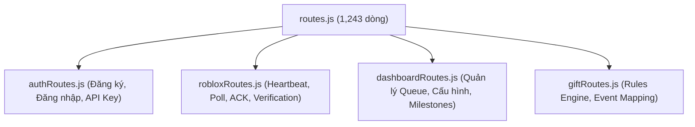

# Kế hoạch chi tiết: Nâng cấp Nền tảng dự án sẵn sàng cho AI (AI-Ready Foundation)

Tài liệu này trình bày lộ trình tái cấu trúc hệ thống (Refactoring) nhằm giải quyết tình trạng phình to tệp nguồn (file bloat) và cải thiện trải nghiệm lập trình kết hợp với trí tuệ nhân tạo (AI Developer Experience).

---

## 🎯 Mục tiêu cốt lõi
- **Tránh tệp nguyên khối (Monolith Prevention):** Chia tách các tệp có kích thước 1.000+ dòng (`routes.js`, `TikTokDanceManager.server.lua`) thành các module chức năng đơn lẻ.
- **Tích hợp Công cụ Kiểm thử & Phân tích tĩnh Luau:** Cấu hình tự động định dạng và bắt lỗi code Roblox trước khi đồng bộ.
- **Kiểm thử Tự động Hóa (E2E & Unit Test):** Đảm bảo backend và frontend có hệ thống test độc lập, chạy offline được trong CI/CD.
- **Đồng bộ hóa Tài liệu & Biến môi trường:** Loại bỏ thông tin lỗi thời trong README và cấu hình database.

---

## 🛠️ Lộ trình triển khai 4 giai đoạn

### Giai đoạn 1: Phân rã mã nguồn nguyên khối (Code Modularization)

1. **Phân tách Route Backend (`apps/api`):**
   - Tách tệp [routes.js](file:///d:/Individua_Project/Auto_dance_Roblox/apps/api/src/backend/routes.js) thành các tệp định tuyến chuyên biệt đặt tại thư mục `apps/api/src/backend/routes/`.
   - Kết nối chúng lại bằng một Router tổng trong `routes.js`.

2. **Phân tách Luau Server (`roblox/server`):**
   - Tách tệp [TikTokDanceManager.server.lua](file:///d:/Individua_Project/Auto_dance_Roblox/roblox/server/TikTokDanceManager.server.lua) thành các **ModuleScript** đặt trong thư mục `roblox/shared` (đồng bộ vào `ReplicatedStorage`):
     - `Config`: Lưu trữ hằng số, ID hoạt ảnh, âm thanh fallback.
     - `DancerManager`: Logic sinh nhân vật (`spawnDancer`), hủy nhân vật, quản lý danh sách vũ công.
     - `ActionExecutor`: Bộ thực thi các hiệu ứng hạt, đổi màu đèn sân khấu, lắc camera.
     - `HTTPClient`: Giao thức gọi API (polling, heartbeat, ACK) hỗ trợ backoff khi lỗi mạng.

---

### Giai đoạn 2: Tích hợp Rojo & Công cụ Phân tích Luau (Luau DX Tools)

1. **Cấu hình StyLua (`stylua.toml`):**
   - Thiết lập cấu hình tự động định dạng code Luau để đảm bảo AI viết code có phong cách đồng nhất với con người.
2. **Cấu hình Selene (`selene.toml`):**
   - Tải về và cấu hình công cụ linter Selene nhằm bắt nhanh các lỗi sử dụng biến global không an toàn, đặt tên biến sai chuẩn trong các file Lua trước khi đẩy vào game.
3. **Cài đặt TestEZ:**
   - Đưa thư viện TestEZ vào thư mục `roblox/shared` và viết các kịch bản kiểm thử cục bộ (`.spec.lua`) cho hàng đợi, cơ chế tính toán CFrame vị trí đứng trên sân khấu mà không cần kết nối livestream thật.

---

### Giai đoạn 3: Tích hợp Unit Test Backend & CI/CD

1. **Cài đặt Vitest / Supertest:**
   - Cài đặt `vitest` và `supertest` làm công cụ kiểm thử backend tại `apps/api`.
   - Mocking thư viện `@prisma/client` để chạy kiểm thử API cục bộ mà không yêu cầu cơ sở dữ liệu PostgreSQL thật phải hoạt động.
2. **Thiết lập GitHub Actions:**
   - Tạo tệp tin `.github/workflows/ci.yml` tự động chạy mỗi khi push code lên nhánh chính:
     - Chạy Lint và Format kiểm tra (ESLint cho JS, StyLua cho Luau).
     - Chạy Unit Test Backend và Frontend.
     - Kiểm tra quy trình build frontend React.

---

### Giai đoạn 4: Đồng bộ hóa Tài liệu & Biến môi trường

1. **Đồng bộ hóa Database:**
   - Cập nhật tệp [..env.example](file:///d:/Individua_Project/Auto_dance_Roblox/.env.example) và [README.md](file:///d:/Individua_Project/Auto_dance_Roblox/README.md) để khẳng định cơ sở dữ liệu mặc định là PostgreSQL (loại bỏ thông tin SQLite cũ gây nhầm lẫn).
2. **Đồng bộ hóa Cổng mạng (Ports):**
   - Đồng bộ cấu hình mặc định là cổng `3001` trên tất cả các tài liệu hướng dẫn và mã nguồn chạy thử.
3. **Cập nhật README:**
   - Viết lại phần giới thiệu cấu trúc thư mục mới theo cấu trúc Monorepo (`apps/api`, `apps/web`, `roblox`) thay cho cấu trúc cũ.
