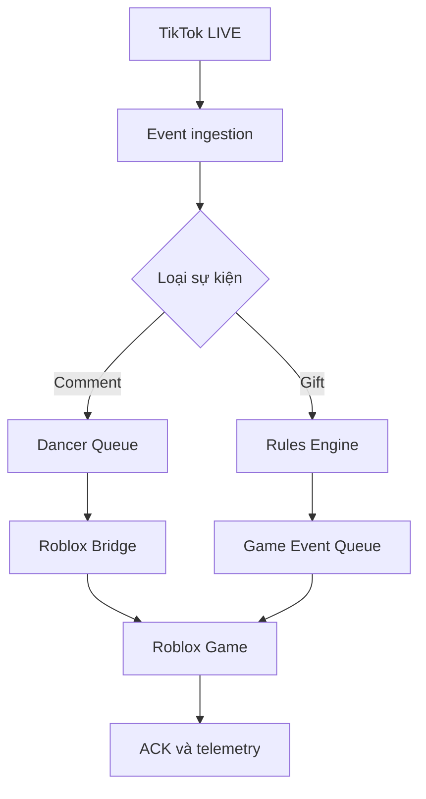

# DANCE LIVE — PRODUCT, FUNCTIONAL & UI/UX SPECIFICATION V1.0

> Tài liệu nguồn để nâng cấp repository `https://github.com/Gnas260605/dance_live` thành một Creator Control Center chuyên nghiệp cho TikTok Live → Roblox.
>
> Trạng thái: Implementation-ready specification  
> Ngày: 04/08/2026  
> Ngôn ngữ sản phẩm mặc định: Tiếng Việt; kiến trúc phải sẵn sàng cho i18n.

---

## 1. Tầm nhìn sản phẩm

Dance Live là ứng dụng giúp streamer kết nối TikTok LIVE với một game Roblox đang chạy. Người xem có thể comment tên Roblox để đưa avatar vào sân khấu và gửi quà để kích hoạt hiệu ứng trực tiếp trong game.

Sản phẩm cuối không được mang cảm giác của một trang quản trị HTML thử nghiệm. Nó phải giống một công cụ livestream thương mại: dễ thiết lập khi chưa live, quan sát rõ khi đang live, xử lý sự cố nhanh và đủ an toàn để vận hành nhiều giờ liên tục.

### 1.1 Giá trị cốt lõi

- Kết nối TikTok LIVE trong vài thao tác.
- Biến comment thành Roblox dancer.
- Biến quà TikTok thành hành động trong Roblox mà không cần sửa Lua.
- Test toàn bộ mapping khi chưa livestream.
- Theo dõi queue, sự kiện, lỗi và trạng thái Roblox theo thời gian thực.
- Lưu cấu hình riêng theo workspace/creator.
- Cho phép mở rộng thêm game, action và nền tảng sự kiện sau này.

### 1.2 Luồng cốt lõi bắt buộc



Ví dụ nghiệm thu quan trọng nhất:

```text
Viewer tặng Rose
→ backend nhận đúng giftId và combo
→ tìm Event Mapping đang Active
→ tạo gameEvent duy nhất
→ Roblox nhận FLOWER_RAIN
→ hoa xuất hiện tại sân khấu
→ hiện tên người tặng
→ Roblox gửi ACK
→ event không chạy lặp lại
```

---

## 2. Phạm vi và nguyên tắc nâng cấp

Đây là bản nâng cấp repository hiện có, không phải viết lại tùy ý.

### 2.1 Chức năng phải giữ nguyên

- TikTok LIVE connection.
- Comment `!dance RobloxUsername` và cú pháp tên đứng riêng nếu đang hỗ trợ.
- Roblox username validation.
- Dancer Queue và active dancer.
- Spawn avatar Roblox.
- Dance animation.
- Smooth camera tracking.
- Music Library và đổi nhạc trực tiếp.
- Dance Emotes.
- Coin Milestones hiện tại.
- Overlay branding.
- Authentication, API key và multi-tenant.
- Quick simulator.

### 2.2 Các giới hạn hiện tại phải khắc phục

- Frontend nằm trong một file `public/index.html` lớn, khó mở rộng và thiếu hệ thống component.
- Gift hiện đi nhờ luồng comment/dancer; phải tách thành game event độc lập.
- Mapping mới dừng ở ngưỡng coin → music.
- Roblox chỉ có một hiệu ứng gift/VIP chung.
- Thiếu ACK/deduplication chuẩn cho game event polling.
- Cấu hình tenant chưa được lưu bền vững đầy đủ.
- UI chưa có trạng thái loading, empty, error, offline và recovery thống nhất.
- Thiếu kiểm tra end-to-end cho TikTok gift → Roblox effect.

### 2.3 Nguyên tắc kỹ thuật

- Không xóa chức năng cũ để làm giao diện mới.
- Không tạo UI giả với dữ liệu hard-code.
- Mọi nút quan trọng phải kết nối API thật hoặc được ghi rõ là chưa triển khai.
- Không hard-code Rose trong Lua như giải pháp cuối.
- Exact gift mapping ưu tiên trước coin milestone fallback.
- Mọi event phải có `eventId` duy nhất và xử lý idempotent.
- Ưu tiên nâng frontend thành React + Vite + TypeScript. Nếu migration theo giai đoạn, backend cũ phải tiếp tục chạy trong thời gian chuyển đổi.
- Không sao chép logo, tên thương mại hoặc asset độc quyền của TikFinity; chỉ học mô hình Events → Actions.

---

## 3. Người dùng và tình huống sử dụng

### 3.1 Creator/Streamer

Muốn kết nối kênh, thiết lập quà, test Roblox, bắt đầu live và giám sát mọi thứ từ một màn hình.

### 3.2 Operator/Moderator

Theo dõi queue và event trong lúc live, skip dancer, replay/test action, tắt rule gây lỗi và xử lý queue bị kẹt.

### 3.3 Admin hệ thống

Quản lý workspace, gói dịch vụ, API key, giới hạn queue, lịch sử hoạt động và sức khỏe kết nối.

### 3.4 Jobs to be done

- “Tôi muốn Rose tạo mưa hoa mà không sửa code.”
- “Tôi muốn biết Roblox có thật sự online trước khi live.”
- “Tôi muốn test quà ảo ngay trên dashboard.”
- “Tôi muốn một quà chạy nhiều hành động theo thứ tự.”
- “Tôi muốn tắt nhanh một mapping bị lỗi khi đang live.”
- “Tôi muốn restart server mà không mất cấu hình.”

---

## 4. Information architecture

### 4.1 Sidebar chính

**LIVE**

1. Live Control
2. Dancer Queue
3. Event Monitor

**AUTOMATION**

4. Events & Actions
5. Action Library
6. Gift Catalogue

**CONTENT**

7. Music Library
8. Dance Emotes
9. Overlay Studio

**SYSTEM**

10. Roblox Connection
11. Analytics & Logs
12. Settings

Sidebar thu gọn chỉ còn icon, có tooltip và lưu trạng thái thu gọn. Mobile dùng drawer; không đơn giản ẩn hoàn toàn navigation.

### 4.2 Top bar

- Breadcrumb hoặc tên màn hình.
- Global search/command palette (`Ctrl/Cmd + K`).
- Roblox status.
- TikTok LIVE status.
- Nút `Go Live Setup` hoặc `Connect TikTok` nổi bật.
- Notifications.
- Workspace switcher.
- User menu.

### 4.3 Command palette

Cho phép:

- Chuyển màn hình.
- Tạo Event.
- Tạo Action.
- Test Rose event.
- Connect/disconnect TikTok.
- Mở Roblox diagnostics.
- Tìm dancer, gift, rule hoặc log.

---

## 5. Design system

### 5.1 Tính cách thị giác

Tối, hiện đại, giàu năng lượng nhưng không lòe loẹt. Cảm giác kết hợp giữa streaming console, game operations và creator SaaS. Dùng màu neon có kiểm soát để thể hiện trạng thái, không phủ gradient lên mọi card.

### 5.2 Color tokens đề xuất

```css
--bg-canvas: #080B12;
--bg-sidebar: #0B0F18;
--surface-1: #101624;
--surface-2: #151D2E;
--surface-3: #1A2438;
--border-subtle: rgba(255,255,255,.08);
--border-strong: rgba(255,255,255,.14);
--text-primary: #F7F9FC;
--text-secondary: #AAB4C5;
--text-muted: #738097;
--accent-cyan: #18D7E8;
--accent-violet: #8B5CF6;
--accent-pink: #F43F86;
--success: #22C55E;
--warning: #F59E0B;
--danger: #EF4444;
--info: #3B82F6;
```

Màu trạng thái phải đi kèm icon/text, không dựa hoàn toàn vào màu.

### 5.3 Typography

- UI: Inter hoặc Geist Sans.
- Heading/brand: Outfit hoặc Space Grotesk, dùng hạn chế.
- ID, API key, asset ID và log: JetBrains Mono.
- Body desktop 14px, line-height 1.5.
- Không dùng chữ 10–11px cho nội dung chính.

### 5.4 Spacing và hình khối

- Grid 4px; khoảng cách chính: 8, 12, 16, 20, 24, 32.
- Card radius: 14–16px.
- Input/button radius: 10–12px.
- Chiều cao input tiêu chuẩn: 40–44px.
- Shadow nhẹ, ưu tiên border và phân cấp surface.
- Nội dung desktop tối đa khoảng 1600px, không để bảng bị kéo quá rộng khó đọc.

### 5.5 Motion

- Hover/focus: 120–180ms.
- Modal/drawer: 180–240ms.
- Không dùng animation liên tục gây phân tâm khi đang live.
- Tôn trọng `prefers-reduced-motion`.
- Live pulse chỉ dùng cho trạng thái thật sự LIVE.

### 5.6 Component nền tảng

- Button: primary, secondary, ghost, danger, icon-only.
- Input, textarea, select, combobox, multi-select.
- Switch, checkbox, segmented control, slider.
- Badge, status dot, tooltip, popover.
- Card, stat card, collapsible section.
- Data table có sticky header.
- Modal, side sheet, confirmation dialog.
- Tabs và stepper.
- Toast và inline alert.
- Skeleton, empty state, error state.
- Gift picker, Action card, Event row, timeline item.

Mọi component phải có hover, focus-visible, disabled, loading, error và success state.

---

## 6. App shell và responsive behavior

### Desktop ≥ 1280px

- Sidebar 248px; có chế độ 72px.
- Top bar 64px.
- Nội dung dùng 12-column grid.
- Event Builder có thể dùng 3 vùng: trigger, actions, preview.

### Tablet 768–1279px

- Sidebar mặc định thu gọn.
- Form chia 2 cột khi đủ rộng.
- Bảng có thể chuyển một số action vào overflow menu.

### Mobile < 768px

- Navigation dạng drawer.
- Bảng Events chuyển thành card list.
- Form Event Builder dùng full-screen sheet và stepper.
- Primary action cố định ở đáy nhưng không che nội dung.
- Không yêu cầu trải nghiệm chỉnh mapping phức tạp hoàn hảo như desktop, nhưng live monitoring và emergency controls phải sử dụng được.

---

## 7. Live Control Center

Đây là màn hình mở mặc định khi operator đang vận hành live.

### 7.1 Hero status strip

Hiển thị bốn trạng thái rõ ràng:

- TikTok: Connected/Connecting/Disconnected/Error.
- Roblox: Online/Degraded/Offline.
- Stream duration.
- Event processing health: Healthy/Backlog/Error.

Nút chính:

- Connect TikTok.
- Disconnect với confirm.
- Run pre-live check.
- Emergency stop all actions.

### 7.2 Now dancing

- Roblox avatar thumbnail nếu lấy được.
- Roblox username và TikTok sender.
- Dance animation đang chạy.
- Thời gian còn lại.
- Replay, focus camera, skip.
- Không có dancer: empty state hướng dẫn comment test.

### 7.3 Queue preview

- 5 người tiếp theo.
- Số lượng tổng.
- VIP badge.
- Estimated wait.
- Drag reorder chỉ cho operator có quyền.
- Clear queue có confirm và giải thích tác động.

### 7.4 Recent gifts/events

- Gift icon thật nếu có URL.
- Sender, gift name, combo và coin.
- Mapping đã match.
- Action status: queued/running/succeeded/failed/expired.
- Replay chỉ tạo event test/audit mới, không tái dùng eventId cũ.

### 7.5 Quick simulator

Hai tab:

- Test comment: TikTok name + Roblox username + VIP flag.
- Test gift: gift picker + count + fake sender + selected event preview.

Trước khi gửi phải hiển thị “Expected actions”.

### 7.6 Live safeguards

- Emergency Stop.
- Pause gift automations.
- Pause dancer intake.
- Clear stuck game events.
- Các thao tác nguy hiểm có confirmation và audit log.

---

## 8. Events & Actions

Đây là tính năng trung tâm, thay thế trang `Gift → Music Map` đơn giản hiện tại.

### 8.1 Events list

Toolbar:

- `Create Event` là CTA chính.
- Search theo tên, gift hoặc action.
- Filter Active/Inactive.
- Filter trigger type.
- Filter action type.
- Sort priority, updated date, gift value.
- View table/card.

Cột desktop:

| Cột | Nội dung |
|---|---|
| Active | Switch bật/tắt nhanh |
| Event | Tên và mô tả ngắn |
| Trigger | Icon + gift + điều kiện combo/coin |
| Actions | Tối đa 3 chip, phần còn lại `+N` |
| Cooldown | Giá trị dễ đọc |
| Last fired | Thời gian và trạng thái |
| Health | Normal/Warning/Error |
| Menu | Edit, Test, Duplicate, View logs, Delete |

Bulk actions:

- Enable/disable.
- Duplicate.
- Delete có confirm.
- Export configuration.

### 8.2 Event Builder

Event Builder dùng stepper ba bước, nhưng cho phép quay lại không mất dữ liệu.

#### Step 1 — Choose trigger

- Event name.
- Description.
- Enabled.
- Trigger type: TikTok Gift trước; kiến trúc sẵn sàng cho Like, Follow, Share, Subscribe, Comment keyword.
- Gift picker có search, icon, name, giftId và coin.
- User filter: Any hoặc danh sách cho phép/chặn.
- Min repeat count.
- Min total coins.
- Streak behavior.
- Exact gift match/fallback behavior.

#### Step 2 — Build actions

- Chọn Action từ library hoặc tạo inline.
- Một Event có nhiều Action.
- Drag-and-drop thứ tự.
- Delay và duration từng Action.
- Enable/disable riêng.
- Duplicate/remove.
- Timeline preview thể hiện action nào chạy lúc nào.
- Cảnh báo xung đột, ví dụ hai action đổi nhạc cùng thời điểm.

#### Step 3 — Rules, test and publish

- Cooldown theo event và theo user.
- Queue mode: `QUEUE`, `REPLACE`, `IGNORE_IF_RUNNING`.
- Priority.
- `stopProcessingAfterMatch`.
- Summary dễ đọc bằng ngôn ngữ tự nhiên.
- Test payload editor ở chế độ Advanced.
- `Test in Roblox`.
- Hiển thị ACK/timeout/error.
- Save Draft và Publish.

### 8.3 Unsaved changes

- Báo khi đóng modal/rời trang.
- Có Save draft, Discard, Continue editing.
- Không âm thầm mất form.

### 8.4 Ví dụ event mặc định

**Rose → Flower Rain**

- Trigger: exact Rose, min count 1.
- Action 1: FLOWER_RAIN tại DanceStage, 5 giây.
- Action 2: SHOW_MESSAGE có sender và repeatCount.
- Cooldown: 500ms.
- Queue mode: QUEUE.

**Hand Heart → Heart Burst**

- HEART_BURST quanh Active Dancer.
- Nếu không có dancer, fallback Stage Center.

**Galaxy → Boss Moment**

- CHANGE_STAGE_LIGHT.
- PLAY_SOUND.
- PARTICLE_EFFECT.
- CAMERA_SHAKE có cường độ an toàn.
- SHOW_MESSAGE.

---

## 9. Action Library

### 9.1 Mục tiêu

Action là cấu hình tái sử dụng. Creator có thể tạo “Rose Rain” một lần và gắn vào nhiều Event.

### 9.2 Action cards/list

- Icon theo action type.
- Tên.
- Loại.
- Duration.
- Số Event đang sử dụng.
- Last tested.
- Health.
- Test, edit, duplicate, delete.

Không cho xóa âm thầm Action đang được Event dùng. Hiển thị danh sách dependency và lựa chọn replace/remove mapping.

### 9.3 Action types V1

| Action | Mục đích | Tham số chính |
|---|---|---|
| FLOWER_RAIN | Hoa rơi | target, count, radius, height, color, duration |
| HEART_BURST | Trái tim | target, count, size, color, duration |
| FIREWORKS | Pháo hoa | target, bursts, palette, height |
| PARTICLE_EFFECT | Particle chung | textureId, target, rate, lifetime, speed |
| PLAY_SOUND | Phát SFX | assetId, volume, loop, fade |
| CHANGE_MUSIC | Đổi nhạc | musicId, transition, restoreAfter |
| CHANGE_STAGE_LIGHT | Đổi đèn | color, brightness, pattern, duration |
| CAMERA_SHAKE | Rung camera | intensity, duration, falloff |
| SPAWN_OBJECT | Spawn object | allowlisted asset, target, lifetime, scale |
| SHOW_MESSAGE | Thông báo | template, duration, style, position |

### 9.4 Dynamic variables

Template editor hỗ trợ autocomplete:

- `{tiktokUsername}`
- `{nickname}`
- `{giftName}`
- `{repeatCount}`
- `{singleCoinValue}`
- `{totalCoins}`
- `{robloxUsername}` nếu có.

Biến không tồn tại phải fallback an toàn, không render `undefined`.

### 9.5 Safety limits

- Particle count, rate, lifetime và object count phải clamp cả backend và Lua.
- Roblox Asset ID phải validate.
- Spawn Object chỉ dùng allowlist.
- Camera shake có mức tối đa.
- Có warning performance theo cấu hình.
- Mỗi action phải tự cleanup sau duration.

---

## 10. Gift Catalogue

### 10.1 Chức năng

- Danh sách gift lấy từ dữ liệu TikTok khi có thể.
- Search theo name/ID.
- Lọc coin tier.
- Icon, giftId, localized name, coin, updated time.
- Badge Dynamic/Static/Streak.
- Xem Event nào đang dùng gift.
- Create Event từ gift.

### 10.2 Data freshness

- Không coi danh sách hard-code là chân lý vĩnh viễn.
- Hiển thị `Last synced`.
- Gift thực nhận nhưng chưa có catalogue phải vẫn được ghi log và có thể tạo mapping từ event đó.
- Khớp bằng giftId; giftName chỉ fallback.

---

## 11. Dancer Queue

- Active dancer ở đầu trang.
- Table/card cho queued dancers.
- TikTok user, Roblox user, source, VIP, wait time, status.
- Search/filter.
- Reorder.
- Skip/remove.
- Retry avatar validation.
- Duplicate protection rõ lý do.
- Cooldown remaining.
- Queue limit và warning 80%/100%.
- Lịch sử dancer gần đây.

Không trộn `gameEventQueue` vào `playerQueue`.

---

## 12. Event Monitor

### 12.1 Realtime event stream

Mỗi row có:

- Timestamp.
- Source event.
- Sender.
- Mapping.
- Actions.
- Queue latency.
- Roblox delivery.
- ACK status.
- Error/retry count.

### 12.2 Filters

- Gift/comment/system/test.
- Queued/running/succeeded/failed/expired.
- Mapping/action.
- Time range.
- TikTok user.

### 12.3 Event detail drawer

- Raw normalized payload, che dữ liệu nhạy cảm.
- Rule evaluation trace.
- Actions timeline.
- Delivery attempts.
- Roblox ACK.
- Error stack chỉ ở developer mode.
- Retry as new event.

---

## 13. Music Library

- Add Roblox Sound Asset ID.
- Title, genre, tags, duration nếu lấy được.
- Preview/test trong Roblox.
- Set active.
- Used by Events/Milestones.
- Search/filter/sort.
- Duplicate ID prevention.
- Delete dependency protection.
- Hiển thị asset validation và permission error rõ ràng.

Coin Milestones tiếp tục tồn tại trong một tab `Fallback Rules` của Events & Actions hoặc Music Library.

---

## 14. Dance Emotes

- Animation name, Roblox Animation ID, genre/tags.
- R15/R6 compatibility nếu xác định được.
- Test on dummy/avatar.
- Set default.
- Search/filter.
- Duplicate detection.
- Used-by references.
- Error rõ khi animation không có quyền chạy trong experience.

---

## 15. Overlay Studio

- Live preview 16:9.
- Title, accent color, font scale.
- Now Dancing widget.
- Gift alert widget.
- Queue widget.
- Safe-area guides.
- Position/visibility controls.
- Template presets.
- Reset to default.
- Preview test gift.
- Không cam kết OBS browser source nếu hệ thống chưa thực sự có endpoint/widget riêng; phải ghi rõ trạng thái triển khai.

---

## 16. Roblox Connection & Diagnostics

### 16.1 Setup panel

- Workspace API key được mask.
- Copy button.
- Rotate key có confirm và cảnh báo cập nhật Lua.
- Server URL.
- Hướng dẫn bật HTTP Requests.
- Script/version đang dùng.

### 16.2 Connection health

- Last heartbeat.
- Roblox server/job ID nếu có.
- Place ID.
- Poll latency.
- Last successful ACK.
- Game event backlog.
- Script version mismatch.

### 16.3 Pre-live checklist

- Backend reachable.
- TikTok username valid.
- Roblox heartbeat received.
- API key accepted.
- Dance spawn test passed.
- Rose effect test passed.
- Music permission checked.
- Không có queue bị kẹt.

Kết quả có Pass/Warning/Fail và nút sửa/mở đúng khu vực.

---

## 17. Analytics & Logs

### 17.1 KPI

- Total comments.
- Valid dance requests.
- Total gifts và estimated coins.
- Events fired.
- Event success rate.
- Roblox average ACK latency.
- Top gifts.
- Top mappings.
- Queue peak.

### 17.2 Charts

- Events theo thời gian.
- Gift distribution.
- Action failures.
- Queue length timeline.

### 17.3 Logs

- INFO/WARN/ERROR.
- Search và filter.
- Correlation/eventId.
- Export JSON/CSV.
- Không hiển thị password, token, API secret hoặc raw authorization header.

---

## 18. Settings

### Workspace

- Name, avatar, timezone, locale.
- Default TikTok account.

### Live behavior

- Dance duration.
- Comment cooldown.
- Max dancer queue.
- Max game event queue.
- Gift fallback rules.

### Notifications

- Connection lost.
- Roblox offline.
- Queue full.
- Action failure.

### Developer

- API key.
- Server endpoint.
- Poll interval trong giới hạn an toàn.
- Debug logging.
- Export/import configuration.

### Danger zone

- Reset configuration.
- Clear history.
- Delete workspace.

Mọi destructive action phải có confirm; thao tác nghiêm trọng yêu cầu nhập tên workspace.

---

## 19. Backend domain model

### 19.1 Event Mapping

```ts
type EventMapping = {
  id: string;
  tenantId: string;
  name: string;
  description?: string;
  enabled: boolean;
  priority: number;
  trigger: {
    type: 'TIKTOK_GIFT';
    giftId?: string;
    giftName?: string;
    minRepeatCount: number;
    minTotalCoins: number;
    userFilter: 'ANY' | 'ALLOWLIST' | 'BLOCKLIST';
    users?: string[];
  };
  actions: EventActionRef[];
  cooldownMs: number;
  userCooldownMs?: number;
  queueMode: 'QUEUE' | 'REPLACE' | 'IGNORE_IF_RUNNING';
  stopProcessingAfterMatch: boolean;
  createdAt: string;
  updatedAt: string;
};
```

### 19.2 Action Definition

```ts
type ActionDefinition = {
  id: string;
  tenantId: string;
  name: string;
  type: ActionType;
  enabled: boolean;
  defaultDelayMs: number;
  defaultDurationMs: number;
  parameters: Record<string, unknown>;
  createdAt: string;
  updatedAt: string;
};
```

### 19.3 Normalized Gift Event

```ts
type NormalizedGiftEvent = {
  eventId: string;
  eventType: 'gift';
  tenantId: string;
  tiktokUserId?: string;
  tiktokUsername: string;
  nickname?: string;
  profilePictureUrl?: string;
  giftId?: string;
  giftName: string;
  giftImageUrl?: string;
  repeatCount: number;
  singleCoinValue: number;
  totalCoins: number;
  isStreak: boolean;
  repeatEnd: boolean;
  receivedAt: string;
};
```

### 19.4 Game Event

```ts
type GameEvent = {
  eventId: string;
  tenantId: string;
  mappingId: string;
  eventType: string;
  actions: ResolvedGameAction[];
  context: Record<string, unknown>;
  createdAt: string;
  expiresAt: string;
  status: 'QUEUED' | 'DELIVERED' | 'ACKED' | 'FAILED' | 'EXPIRED';
  deliveryAttempts: number;
};
```

---

## 20. API specification

### Dashboard

```text
GET    /api/v1/dashboard/event-mappings
POST   /api/v1/dashboard/event-mappings
GET    /api/v1/dashboard/event-mappings/:id
PUT    /api/v1/dashboard/event-mappings/:id
DELETE /api/v1/dashboard/event-mappings/:id
POST   /api/v1/dashboard/event-mappings/:id/test
POST   /api/v1/dashboard/event-mappings/:id/duplicate

GET    /api/v1/dashboard/actions
POST   /api/v1/dashboard/actions
GET    /api/v1/dashboard/actions/:id
PUT    /api/v1/dashboard/actions/:id
DELETE /api/v1/dashboard/actions/:id
POST   /api/v1/dashboard/actions/:id/test

GET    /api/v1/dashboard/events
GET    /api/v1/dashboard/events/:eventId
POST   /api/v1/dashboard/events/:eventId/retry

GET    /api/v1/gifts
POST   /api/v1/dashboard/preflight
```

### Roblox bridge

```text
GET  /api/v1/streamer/:apiKey/current-player
GET  /api/v1/streamer/:apiKey/game-events
POST /api/v1/streamer/:apiKey/game-events/:eventId/ack
POST /api/v1/streamer/:apiKey/heartbeat
```

### API behavior

- Response có `success`, `data`, `error`, `requestId` nhất quán.
- Validation error trả field-level errors.
- Pagination cho event/log list.
- Rate limit theo endpoint.
- Auth và tenant isolation bắt buộc.
- Không dùng API key demo làm fallback cho request production đã xác thực sai.
- Audit log cho create/update/delete/test và emergency operations.

---

## 21. Gift processing rules

1. `connection.on('gift')` không gọi `processNewCommentForTenant()`.
2. Tạo `processGiftEventForTenant()` riêng.
3. Streak packet có `repeatEnd === false` không tạo final game event.
4. Khi kết thúc streak, xử lý đúng một lần với tổng repeat count.
5. Match exact `giftId` trước.
6. Nếu thiếu ID, fallback normalized gift name.
7. Sau exact mapping, chỉ chạy coin milestone nếu chưa match hoặc rule cho phép.
8. Enforce cooldown.
9. Resolve actions thành payload an toàn.
10. Đẩy vào `gameEventQueue` riêng.
11. Roblox ACK theo eventId.
12. Expire và cleanup event cũ.

---

## 22. Roblox Action Executor

Trong `TikTokDanceManager.server.lua`, dùng handler registry thay vì chuỗi if/else khó mở rộng.

```lua
local ActionHandlers = {}

ActionHandlers.FLOWER_RAIN = function(action, context)
    -- validate, clamp, execute, cleanup
end

ActionHandlers.HEART_BURST = function(action, context)
end
```

Yêu cầu:

- Mỗi eventId chạy tối đa một lần trong Roblox server hiện tại.
- Có cache eventId đã xử lý với giới hạn kích thước/thời gian.
- Mỗi action được `pcall` riêng.
- Delay theo timeline nhưng không block polling loop chính.
- Clamp mọi parameter lần hai ở Lua.
- Cleanup ParticleEmitter, Attachment, Sound và spawned object.
- Target resolver chung: `DANCE_STAGE`, `ACTIVE_DANCER`, `STAGE_CENTER`, `CUSTOM_POSITION`.
- Active dancer không tồn tại thì fallback an toàn.
- ACK gồm success/partial failure và action result tóm tắt.
- Heartbeat để dashboard biết game online.

---

## 23. Persistence và migration

Không được để Event Mapping/Action Library chỉ nằm trong RAM.

### Yêu cầu

- Lưu users, tenant settings, event mappings, actions, libraries và milestones.
- Có migration từ cấu hình cũ.
- Không duy trì JSON và Prisma như hai nguồn chân lý mâu thuẫn.
- Development có thể dùng SQLite; production phải có đường nâng cấp rõ.
- Seed default Rose/Heart/Galaxy mappings nhưng không ghi đè mapping của người dùng.
- Backup/export cấu hình dạng JSON có version.
- Import phải validate schema và preview thay đổi.

---

## 24. UX states và error recovery

Mọi màn hình quan trọng phải thiết kế đủ:

- Initial loading: skeleton, không dùng spinner toàn trang kéo dài.
- Empty: mô tả lý do + CTA phù hợp.
- Partial error: giữ phần dữ liệu còn dùng được.
- Offline: banner cố định nhưng không che thao tác local.
- Saving: disable submit và chống double click.
- Success: toast ngắn + cập nhật UI.
- Validation error: ngay dưới field và focus field đầu tiên.
- Permission error: giải thích Roblox asset/game permission.
- Timeout: Retry và mở diagnostics.
- Connection lost: exponential reconnect + trạng thái rõ.

Không dùng `alert()`/`confirm()` mặc định của browser trong giao diện production.

---

## 25. Accessibility

- WCAG 2.1 AA cho contrast chính.
- Điều khiển được bằng keyboard.
- Focus-visible rõ.
- Icon button có accessible name.
- Modal trap focus và trả focus đúng chỗ.
- Bảng có header semantic.
- Status không chỉ dùng màu.
- Form có label thật.
- Toast quan trọng dùng live region hợp lý.
- Reduced motion.
- Gift icon có alt text phù hợp.

---

## 26. Security và reliability

- Validate/sanitize toàn bộ input.
- Parameter schema riêng theo từng action type.
- API key mask; rotate có audit.
- Không log token/password/secret.
- Tenant A không đọc/sửa dữ liệu tenant B.
- Rate limit connect, test, event create và Roblox polling.
- Payload size limit.
- Queue size limit và backpressure.
- Event expiry.
- Retry giới hạn.
- Idempotency cho test/ACK khi phù hợp.
- CORS theo môi trường.
- Production không dùng JWT secret mặc định.
- Roblox SPAWN_OBJECT chỉ dùng allowlist.

---

## 27. Performance targets

- Dashboard first meaningful content trong điều kiện bình thường: mục tiêu < 2.5s.
- UI interaction phản hồi thị giác < 100ms.
- Gift ingestion đến game queue: mục tiêu < 500ms, không tính TikTok/network ngoài kiểm soát.
- Roblox polling/dispatch: cấu hình cân bằng giữa latency và HTTP limit.
- Events table dùng pagination/virtualization khi dữ liệu lớn.
- Không render lại toàn trang mỗi lần status poll.
- Không tạo particle/object không giới hạn.

---

## 28. Frontend architecture đề xuất

```text
frontend/
  src/
    app/
    components/
      ui/
      layout/
      events/
      actions/
      live/
      roblox/
    features/
      auth/
      live-control/
      dancer-queue/
      event-builder/
      action-library/
      gift-catalogue/
      music-library/
      analytics/
    services/
      api/
      realtime/
    hooks/
    stores/
    types/
    utils/
```

Đề xuất:

- React + Vite + TypeScript.
- React Router.
- TanStack Query cho server state.
- Zustand hoặc Context nhỏ cho UI/client state; không lạm dụng global store.
- React Hook Form + Zod.
- Tailwind CSS hoặc CSS variables + component primitives, nhưng phải tuân thủ token.
- Lucide icons.
- Recharts cho analytics nếu cần.
- WebSocket/SSE cho dashboard realtime nếu backend hỗ trợ; Roblox vẫn có thể polling.

Không bắt buộc thư viện nếu làm tăng độ phức tạp vô ích. Kết quả UX và maintainability là tiêu chí chính.

---

## 29. Testing strategy

### Unit

- Gift normalization.
- Streak aggregation.
- Exact mapping priority.
- Coin fallback.
- Cooldown.
- Action validation.
- Template variable rendering.

### API integration

- CRUD event/action.
- Tenant isolation.
- Test event.
- Poll + ACK.
- Persistence after restart.

### Frontend

- Event Builder validation.
- Unsaved changes.
- Loading/error/empty states.
- Filter/search.
- Keyboard access.

### End-to-end

1. Rose x1 → FLOWER_RAIN.
2. Rose streak intermediate packet → không trigger.
3. Rose streak end → một event duy nhất.
4. Một event nhiều action → đúng thứ tự.
5. Disabled mapping → không chạy.
6. Cooldown → chặn đúng.
7. Tenant isolation.
8. Roblox poll lặp → không chạy lại eventId.
9. ACK → trạng thái cập nhật.
10. Restart → không mất mapping.
11. Gift → không spawn avatar ngoài ý muốn.
12. `!dance` cũ → không regression.

---

## 30. Acceptance criteria theo giai đoạn

### Phase 1 — Foundation

- Frontend component hóa và app shell mới.
- Design tokens và responsive navigation.
- Không mất chức năng dashboard cũ.
- Persistence được sửa.

### Phase 2 — Events Engine

- Gift/comment tách luồng.
- Event Mapping + Action Library CRUD thật.
- Game Event Queue + ACK.
- Rose → FLOWER_RAIN end-to-end.

### Phase 3 — Production UX

- Event Builder hoàn chỉnh.
- Monitor, diagnostics, preflight.
- Các UX states và accessibility.
- Tests chính vượt qua.

### Phase 4 — Analytics & hardening

- Analytics/logs.
- Export/import.
- Security review.
- Performance và soak test.

---

## 31. Definition of done

Một tính năng chỉ được xem là hoàn thành khi:

- UI dùng API thật.
- Backend xử lý và lưu dữ liệu thật.
- Roblox nhận và thực thi nếu tính năng liên quan game.
- Có loading/error/empty/success state.
- Có validation.
- Có test tương ứng.
- Không phá chức năng cũ.
- Có hướng dẫn sử dụng.
- Các giới hạn chưa kiểm chứng được báo rõ.

Không được báo “done” khi chỉ có giao diện, mock data hoặc code chưa chạy test.

---

## 32. Chỉ dẫn triển khai dành cho Gemini/Coding Agent

1. Đọc toàn bộ repository trước khi sửa, đặc biệt:
   - `server.js`
   - `src/backend/routes.js`
   - `src/backend/store.js`
   - `src/backend/tiktokManager.js`
   - `src/server/TikTokDanceManager.server.lua`
   - `src/client/SmoothCameraController.client.lua`
   - `public/index.html`
   - `prisma/schema.prisma`
   - `scripts/`
2. Báo cáo kiến trúc hiện tại và các điểm lệch so với tài liệu này.
3. Đề xuất kế hoạch theo phase và danh sách file sẽ sửa.
4. Không rewrite toàn bộ một lần nếu chưa tạo đường migration an toàn.
5. Sau mỗi phase, chạy test và báo kết quả thật.
6. Không thay API đang được Roblox dùng mà không giữ tương thích hoặc cập nhật đồng bộ Lua.
7. Không dùng dữ liệu giả trong bản bàn giao cuối.
8. Trả danh sách file đã sửa, migration, API, hướng dẫn chạy và manual test Roblox.
9. Nếu không thể mở TikTok LIVE/Roblox Studio trong môi trường agent, nói rõ phần nào chỉ được kiểm chứng bằng test/mocking.
10. Ưu tiên hoàn thành vertical slice `Rose → FLOWER_RAIN → ACK` trước khi mở rộng tất cả action.

---

## 33. Kết quả sản phẩm mong đợi

Khi hoàn thành, một creator mới phải có thể:

1. Đăng nhập và mở workspace.
2. Kiểm tra TikTok và Roblox connection.
3. Mở Events & Actions.
4. Chọn Rose.
5. Chọn hoặc tạo Flower Rain.
6. Điều chỉnh số hoa, màu, vị trí và duration.
7. Test trong Roblox.
8. Nhìn thấy ACK thành công.
9. Publish Event.
10. Bắt đầu live và theo dõi gift chạy trong Event Monitor.

Toàn bộ quy trình trên phải thực hiện được mà không sửa JavaScript hoặc Lua bằng tay.

