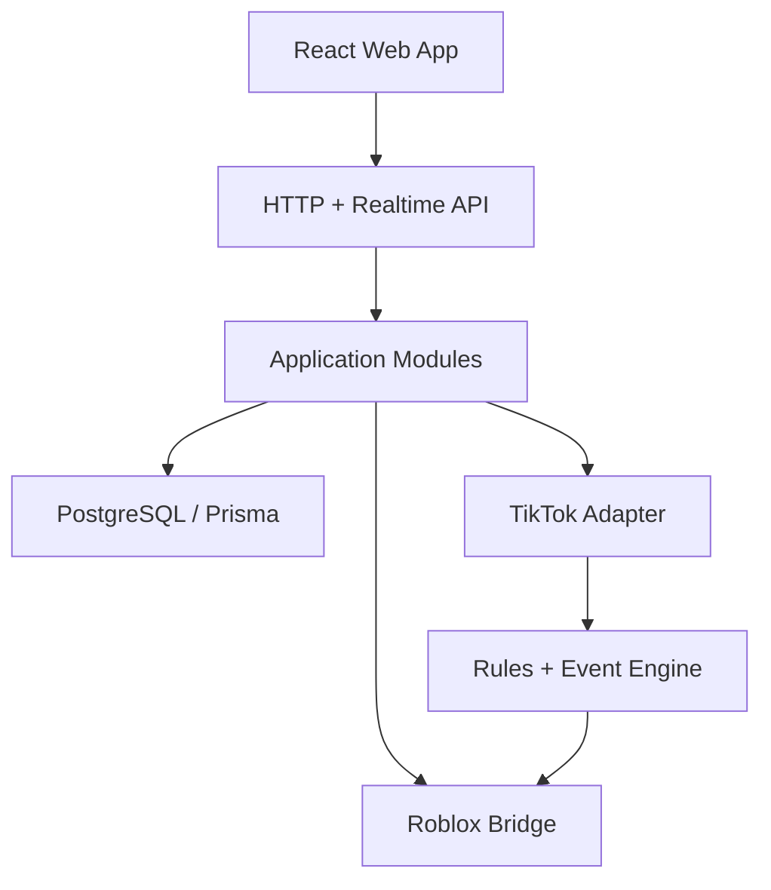

# DANCE LIVE — PRODUCTION REBUILD PLAN V1.0

> Repository: `https://github.com/Gnas260605/dance_live`
>
> Production URL audited: `https://dance-live.onrender.com/`
>
> Date: 2026-08-06
>
> Status: IMPLEMENTATION PLAN — READY FOR PHASE 0

---

## 0. Mục tiêu của bản rebuild

Nâng Dance Live từ prototype đang chạy thành một Creator Control Center có thể vận hành livestream thật, mở rộng lâu dài và cho nhiều workstream/AI skill cùng phát triển mà không sửa chồng chéo.

Không rewrite mù quáng. Hệ thống hiện tại vẫn phải chạy trong lúc migrate.

### Product loop bắt buộc phải giữ

```text
TikTok LIVE
  -> comment -> Dancer Queue -> Roblox avatar -> dance/camera
  -> gift    -> Rules Engine -> Game Event -> Roblox effect -> ACK
```

### Definition of Production Ready

- Creator đăng nhập và chỉ thấy dữ liệu workspace của mình.
- Kết nối/disconnect TikTok ổn định và có recovery state rõ ràng.
- Comment hợp lệ tạo dancer đúng một lần.
- Gift hợp lệ tạo event đúng một lần.
- Event mapping cấu hình được trên UI, không cần sửa Lua.
- Roblox nhận event, thực thi action và ACK idempotent.
- Restart backend không làm mất settings, mapping, library hoặc event quan trọng.
- API có validation, auth, rate limit, structured error và audit log.
- UI có loading/empty/error/offline/retry state thực.
- Có unit, integration, contract và end-to-end tests cho critical path.
- Deploy có migration, health check, rollback và log đủ để chẩn đoán.

---

## 1. Audit hiện trạng — 2026-08-06

Audit dựa trên repository hiện tại và HTML thực tế trả về từ bản Render production.

### 1.1 Điểm đang làm đúng và nên giữ

- Express backend đã có route layer, TikTok manager, middleware và security helper riêng.
- Đã có khái niệm multi-tenant/API key.
- Đã có Event Mapping, Action Definition, Game Event Queue và ACK endpoint.
- Đã có Roblox heartbeat và dance status.
- Prisma schema đã mô hình hóa phần lớn domain cần thiết.
- Có Dockerfile, docker-compose và script test event-engine cơ bản.
- Bản UI hiện tại đã xác định được information architecture và visual direction tốt hơn prototype ban đầu.
- Tài liệu `DANCE-LIVE-PRODUCT-UI-UX-SPEC-V1.md` đã mô tả khá đầy đủ product behavior; rebuild phải dùng nó làm functional reference, không bỏ đi.

### 1.2 Nợ kỹ thuật quan trọng

| Mức | Hiện trạng | Rủi ro | Quyết định |
| --- | --- | --- | --- |
| P0 | `public/index.html` ~856 dòng / ~48 KB chứa HTML + CSS + JS | UI càng thêm tính năng càng khó sửa/test | Migrate sang React + TypeScript theo feature |
| P0 | `src/backend/routes.js` ~992 dòng | Một router đang gánh quá nhiều domain | Chia route/controller/service theo module |
| P0 | `store.js` giữ phần lớn tenant state trong RAM | Restart/deploy làm mất state | Database là SSOT cho persistent state |
| P0 | JSON store và Prisma schema cùng tồn tại nhưng Prisma chưa là data path chính | Hai nguồn chân lý | Loại JSON khỏi production path sau migration |
| P0 | JWT secret có fallback hard-code | Secret mặc định nguy hiểm | Production bắt buộc env secret, fail-fast nếu thiếu |
| P0 | Dashboard dùng `optionalAuth` + fallback demo tenant | Có thể lẫn data/behavior production với demo | Tách `/demo` khỏi authenticated workspace |
| P0 | Demo API key tồn tại ở backend và Lua | Dễ triển khai nhầm cấu hình demo | Production bắt buộc key/secret riêng |
| P1 | `cors()` mở toàn bộ origin | Tăng attack surface | Allowlist theo environment |
| P1 | API key xuất hiện trong URL streamer path | Có thể lọt vào logs/history | Ưu tiên header/HMAC, path cũ chỉ compatibility |
| P1 | Có route trùng `emergency-stop` | Behavior khó đoán, khó maintain | Một command handler duy nhất |
| P1 | Gift catalogue/value hard-code | Dữ liệu TikTok thay đổi gây sai | Event payload runtime là nguồn chính; catalogue là cache/config |
| P1 | Frontend polling toàn dashboard mỗi 2.5s | Tốn request và trạng thái realtime kém | SSE/WebSocket cho dashboard; giữ polling Roblox khi cần |
| P1 | Test hiện tại chủ yếu mutate in-memory state | Có thể PASS nhưng production vẫn hỏng | Bổ sung DB/API/contract/E2E tests |
| P2 | Error/log format chưa thống nhất | Khó debug live incident | Structured error + requestId + structured log |

### 1.3 Quy tắc bảo tồn

Không xóa hoặc đổi behavior của các luồng sau cho đến khi đã có regression test tương ứng:

1. TikTok connect/disconnect.
2. `!dance RobloxUsername` và parser đang được chấp nhận.
3. Roblox username validation.
4. Dancer queue / active dancer / skip / clear.
5. Music Library + play now.
6. Dance Emotes.
7. Event Mappings / Action Library.
8. Gift simulation.
9. Game Event polling + ACK.
10. Roblox heartbeat.
11. Overlay settings.

---

## 2. Quyết định kiến trúc

### 2.1 Không dùng microservices ở giai đoạn này

Chọn **modular monolith**. Một production service giúp deploy, debug và chi phí đơn giản; bên trong code vẫn có module boundary đủ rõ để sau này tách service nếu tải thực tế yêu cầu.

### 2.2 Target architecture



### 2.3 Stack mục tiêu

| Layer | Chọn | Lý do |
| --- | --- | --- |
| Frontend | React + Vite + TypeScript | Component hóa và build nhanh, phù hợp dashboard |
| Routing | React Router | Route thật thay vì `navigate()` trong một HTML |
| Server state | TanStack Query | Cache/invalidation/loading/error rõ |
| Form/validation | React Hook Form + shared schema validation | Form phức tạp nhưng ít boilerplate |
| UI primitives | Tailwind CSS + accessible headless primitives | Design system linh hoạt, không khóa vào theme nặng |
| Backend | Express + TypeScript | Giữ ecosystem hiện tại, migrate an toàn |
| Validation/contracts | Zod hoặc schema library thống nhất | Một contract cho web/API/tests |
| Database | PostgreSQL production, Prisma ORM | Persistence thật, transaction, constraint; SQLite chỉ local/test nếu cần |
| Realtime web | SSE trước; WebSocket chỉ khi cần two-way realtime | Đủ cho status/event/log stream và đơn giản vận hành |
| Roblox bridge | HTTP pull + ACK hiện tại, có HMAC | Roblox-compatible, ít rủi ro migration |
| Logging | Structured JSON logger + requestId | Search incident theo event/user/request |
| Unit/integration | Vitest + API integration tooling | Fast feedback |
| Browser E2E | Playwright | Test critical dashboard flow |

Không khóa version package trong tài liệu này. Khi Phase 1 bắt đầu phải chọn stable versions, commit lockfile và không tự nâng major giữa phase.

---

## 3. Cấu trúc repository mục tiêu

```text
dance_live/
├─ apps/
│  ├─ web/
│  │  ├─ src/
│  │  │  ├─ app/                 # router, providers, app shell
│  │  │  ├─ features/
│  │  │  │  ├─ live-control/
│  │  │  │  ├─ dancer-queue/
│  │  │  │  ├─ event-monitor/
│  │  │  │  ├─ event-mappings/
│  │  │  │  ├─ action-library/
│  │  │  │  ├─ gift-catalogue/
│  │  │  │  ├─ music-library/
│  │  │  │  ├─ dance-emotes/
│  │  │  │  ├─ overlay-studio/
│  │  │  │  ├─ roblox/
│  │  │  │  └─ settings/
│  │  │  ├─ components/          # generic UI only
│  │  │  ├─ lib/                 # api client, realtime, helpers
│  │  │  └─ styles/              # tokens + global styles
│  │  └─ tests/
│  └─ api/
│     └─ src/
│        ├─ app/                  # bootstrap/middleware/error handling
│        ├─ modules/
│        │  ├─ auth/
│        │  ├─ workspace/
│        │  ├─ tiktok/
│        │  ├─ dancers/
│        │  ├─ gifts/
│        │  ├─ automation/
│        │  ├─ game-events/
│        │  ├─ music/
│        │  ├─ dances/
│        │  ├─ overlay/
│        │  ├─ roblox/
│        │  └─ telemetry/
│        ├─ infrastructure/       # db/logger/config/external adapters
│        └─ server.ts
├─ packages/
│  ├─ contracts/                  # DTO/schema/event contracts
│  ├─ config/                     # shared TS/lint config
│  └─ test-utils/
├─ roblox/
│  ├─ client/
│  ├─ server/
│  └─ shared/
├─ prisma/
│  ├─ schema.prisma
│  └─ migrations/
├─ scripts/
├─ tests/
│  ├─ contract/
│  └─ e2e/
├─ docs/
└─ package.json
```

### Boundary rule

- `features/*` không import file nội bộ của feature khác; giao tiếp qua public API của feature hoặc shared contracts.
- Route không chứa business logic.
- Controller không truy cập Prisma trực tiếp.
- Service/domain không biết Express `req/res`.
- Repository không chứa business rule.
- TikTok/Roblox SDK nằm sau adapter interface.
- `packages/contracts` không phụ thuộc UI hoặc database.
- Roblox Lua chỉ hiểu versioned game-event contract, không hiểu database/web internals.

---

## 4. Domain model chuẩn

### 4.1 Persistent — phải nằm DB

- User
- Workspace/Creator profile
- Credentials metadata/API key hash/secret rotation metadata
- StreamConfig
- MusicTrack
- DanceAnimation
- EventMapping
- ActionDefinition
- StreamSession
- GameEvent
- EventDeliveryAttempt hoặc delivery metadata
- RobloxSession snapshot
- AuditLog quan trọng

### 4.2 Ephemeral — có thể ở memory/cache

- Live TikTok connector object/socket.
- Short-lived heartbeat cache.
- Very short status cache.

Mọi thứ creator kỳ vọng vẫn còn sau restart **không được** chỉ lưu trong RAM.

### 4.3 GameEvent state machine

```text
QUEUED -> DELIVERED -> ACKED
   |          |
   |          -> RETRY_WAIT -> DELIVERED
   -> EXPIRED
   -> CANCELLED
FAILED chỉ là terminal khi retry policy đã hết
```

Invariants:

- `eventId` globally unique.
- Một Roblox server ACK cùng `eventId` nhiều lần vẫn cho cùng kết quả.
- Event đã `ACKED` không chạy lại do polling.
- Delivery attempt có timestamp và result.
- Event có TTL.
- Emergency stop không xóa lịch sử audit; chỉ cancel pending work.

---

## 5. API strategy

### 5.1 Giữ compatibility trước

Không đổi đồng loạt endpoint Lua đang dùng. Tạo facade tương thích rồi migrate consumer sau.

### 5.2 API namespaces

```text
/api/v1/auth/*
/api/v1/dashboard/*
/api/v1/roblox/*
/api/v1/health/*
```

`/v1/streamer/:apiKey/*` cũ được đánh dấu compatibility/deprecated sau khi Roblox script mới hoạt động.

### 5.3 Response envelope

Success:

```json
{
  "data": {},
  "meta": { "requestId": "..." }
}
```

Error:

```json
{
  "error": {
    "code": "EVENT_MAPPING_INVALID",
    "message": "...",
    "details": {}
  },
  "meta": { "requestId": "..." }
}
```

### 5.4 Security rules

- Dashboard endpoints: authenticated session/token; không fallback demo tenant.
- Roblox endpoints: API credential riêng + timestamp + signature/HMAC khi khả thi.
- Không log raw token, password, API secret.
- API key không đưa vào frontend nếu không thật sự cần.
- Production startup fail nếu thiếu secret bắt buộc.
- CORS allowlist.
- Rate limit theo endpoint category.
- Body size limit.
- Validate params/query/body ở boundary.
- Rotate/revoke API credentials được.

---

## 6. Event engine và TikTok ingestion

### 6.1 Tách event ingestion khỏi action execution

```text
TikTok adapter
 -> normalize event
 -> dedupe
 -> domain event
 -> rules evaluator
 -> action plan
 -> persistent GameEvent
 -> Roblox delivery
 -> ACK
```

### 6.2 Normalized event contract

Mỗi input event có tối thiểu:

- source
- sourceEventId nếu provider có
- eventType
- workspaceId
- viewer identity
- timestamp
- gift identity/value/repeat metadata khi là gift
- raw metadata chỉ giữ phần cần cho debug và privacy policy

### 6.3 Gift rule precedence

1. Exact `giftId` mapping đang enabled.
2. Constraint repeat/coins/user filter.
3. Priority.
4. `stopProcessingAfterMatch`.
5. Coin milestone fallback chỉ khi không có exact rule phù hợp hoặc rule cấu hình cho phép.

Không coi danh sách coin hard-code trong source là nguồn chân lý vĩnh viễn.

---

## 7. Frontend production UX

### 7.1 Route thật

```text
/live
/queue
/events
/automation/mappings
/automation/actions
/gifts
/music
/dances
/overlay
/roblox
/logs
/settings
```

### 7.2 App shell

- Desktop sidebar collapse 248px -> 72px.
- Mobile drawer, không ẩn navigation.
- Topbar hiển thị TikTok + Roblox health.
- Command palette là enhancement, không block MVP.
- Connection state là server truth, không tự giả lập bằng UI.

### 7.3 Page acceptance pattern

Mọi data page phải có đủ:

1. Loading/skeleton.
2. Loaded/data.
3. Empty state.
4. Error + retry.
5. Offline/degraded nếu liên quan realtime.
6. Optimistic update chỉ khi rollback an toàn.

### 7.4 Design system

Giữ hướng visual dark creator-console của spec hiện tại nhưng chuẩn hóa thành tokens và component variants.

- Không inline style ở feature page trừ giá trị runtime thật sự dynamic.
- Không `onclick` inline.
- Không `innerHTML` để render data.
- Không gọi `fetch` trực tiếp rải rác trong component; đi qua typed API client/query layer.
- Không hard-code mock data trong production component.
- Accessibility: focus-visible, keyboard nav, labels, reduced motion, contrast.

---

## 8. Roblox contract

### 8.1 Roblox không phụ thuộc dashboard implementation

Lua chỉ cần biết:

- heartbeat request/response
- current dancer contract
- game event contract
- ACK contract

### 8.2 Action payload

Mọi action có dạng versioned envelope:

```json
{
  "type": "FLOWER_RAIN",
  "version": 1,
  "delayMs": 0,
  "durationMs": 5000,
  "params": {}
}
```

Action handler Lua nằm trong registry theo `type`, không tạo một chuỗi `if gift == Rose` ngày càng dài.

### 8.3 ACK

ACK phải có:

- eventId
- success
- errorCode/errorMessage khi thất bại
- Roblox jobId/server identity
- executedAt

---

## 9. Persistence và database migration

### Quyết định

Prisma là data access chính. PostgreSQL là production database. JSON `data/store.json` chỉ là legacy import/backup trong giai đoạn chuyển tiếp, không được tiếp tục là SSOT.

### Migration order

1. Chốt schema + indexes + constraints.
2. Viết repository interfaces.
3. Viết Prisma repositories.
4. Viết one-time importer từ JSON/demo state nếu cần giữ data.
5. Dual-read chỉ trong thời gian rất ngắn nếu bắt buộc; tránh dual-write kéo dài.
6. Verification script so sánh record counts/config critical fields.
7. Switch production reads/writes sang DB.
8. Archive JSON path.

### Index tối thiểu cần review

- User email/API credential lookup.
- EventMapping by workspace + enabled + priority.
- GameEvent by workspace + status + createdAt.
- GameEvent unique `eventId`.
- StreamLog by session + timestamp.
- RobloxSession by workspace/user.

---

## 10. Observability và vận hành

### Required

- `GET /api/v1/health/live`: process up.
- `GET /api/v1/health/ready`: DB/config dependencies ready.
- requestId cho mọi request.
- structured JSON logs.
- log context: workspaceId, requestId, eventId, Roblox jobId; không log secret.
- uncaught error/rejection policy rõ ràng.
- graceful shutdown: stop accepting new work, disconnect TikTok, close DB.

### Dashboard operational metrics

- TikTok connection state + last event time.
- Roblox last heartbeat + jobId/placeId.
- dancer queue depth.
- pending game events.
- event ACK latency.
- failed/expired event count.
- gifts/comments for current stream session.

---

## 11. Testing strategy

### Pyramid

| Test | Mục tiêu |
| --- | --- |
| Unit | parser, rules, queue, state machine, validation |
| Repository integration | Prisma constraints/persistence |
| API integration | auth + tenant isolation + CRUD + status |
| Contract | backend <-> Roblox payload compatibility |
| E2E | user workflow trên dashboard |
| Smoke | deployed `/health` + critical read-only flow |

### Critical E2E P0

#### E2E-01 — Comment to dancer

```text
simulate valid comment
-> queue exactly +1
-> Roblox pulls dancer
-> dance status callback
-> dashboard reflects active dancer
```

#### E2E-02 — Rose to Flower Rain

```text
simulate Rose
-> exact mapping selected
-> one GameEvent persisted
-> Roblox receives FLOWER_RAIN
-> ACK
-> same poll cannot execute it again
```

#### E2E-03 — Restart persistence

```text
save mapping/settings
-> restart API
-> settings/mapping still exist
```

#### E2E-04 — Tenant isolation

```text
creator A creates mapping
-> creator B cannot read/update/delete/test it
```

#### E2E-05 — Emergency stop

```text
pending dancer/events exist
-> emergency stop
-> pending work cancelled safely
-> audit history remains
```

---

## 12. CI/CD và deploy trên Render

### Pull request checks

1. install from lockfile.
2. lint.
3. typecheck.
4. unit tests.
5. integration tests.
6. build web + API.
7. contract tests.

### Release order

1. Backup DB.
2. `prisma migrate deploy`.
3. Deploy application.
4. readiness passes.
5. smoke tests.
6. monitor error/event ACK metrics.

Không dùng `prisma db push` làm production migration policy lâu dài. Production schema change phải có migration được review.

### Rollback rule

- App rollback phải tương thích database migration vừa chạy.
- Destructive DB migration dùng expand/migrate/contract, không drop column cùng release với code switch.
- Mỗi phase lớn có tag/release checkpoint.

---

## 13. Phased implementation plan

## PHASE 0 — Baseline & Freeze

Mục tiêu: biết chính xác cái gì đang chạy trước khi đổi kiến trúc.

Tasks:

- Chụp endpoint inventory.
- Viết characterization tests cho behavior hiện tại.
- Ghi sample contracts TikTok normalized event và Roblox responses.
- Bổ sung `npm` scripts thống nhất: lint/test/build/typecheck ở mức có thể.
- Tạo `.env.example`, config schema, health endpoint cơ bản.
- Đánh dấu demo-only behavior.

Gate 0 PASS khi:

- Critical legacy flow có test hoặc fixture.
- Current production behavior được ghi lại.
- Không có refactor lớn trong Phase 0.

## PHASE 1 — Monorepo Skeleton + React Shell

Mục tiêu: tạo khung mới nhưng backend cũ vẫn phục vụ được.

Tasks:

- Tạo `apps/web`, `apps/api`, `packages/contracts`.
- Setup TypeScript, lint, formatting, test runner.
- Tạo design tokens + UI primitives.
- Tạo React app shell, router, auth guard, API client.
- Migrate trang `Live Control` đầu tiên chỉ dùng API thật.

Gate 1 PASS khi:

- Build production thành công.
- `/live` hiển thị status thật.
- Không cần inline script/CSS cho trang đã migrate.
- Legacy dashboard vẫn có rollback path.

## PHASE 2 — Persistence + Auth Hardening

Mục tiêu: bỏ state quan trọng khỏi RAM và khóa tenant boundary.

Tasks:

- PostgreSQL + reviewed Prisma migrations.
- Repositories cho users/config/mappings/actions/events.
- Persist tenant settings, mappings, libraries và GameEvents.
- Dashboard auth required.
- Xóa production fallback secret/demo tenant behavior.
- Credential rotation foundation.

Gate 2 PASS khi:

- Restart persistence E2E pass.
- Tenant isolation E2E pass.
- Không còn production write path quan trọng chỉ vào JSON/in-memory.

## PHASE 3 — Event Engine V2

Mục tiêu: TikTok gift -> rules -> persistent GameEvent là deterministic.

Tasks:

- Normalize TikTok events.
- Dedupe strategy.
- Rules evaluator thuần, test được.
- Durable GameEvent state machine.
- ACK idempotency.
- Retry/TTL/dead-letter behavior.
- Emergency stop dạng cancel, không xóa audit.

Gate 3 PASS khi:

- Rose -> Flower Rain contract/E2E pass.
- Duplicate gift/event không tạo duplicate action ngoài policy.
- Restart trong lúc pending event không làm mất event.

## PHASE 4 — Full Frontend Migration

Migrate theo thứ tự:

1. Live Control.
2. Dancer Queue.
3. Event Monitor.
4. Events & Actions.
5. Action Library.
6. Gift Catalogue.
7. Music Library.
8. Dance Emotes.
9. Overlay Studio.
10. Roblox diagnostics.
11. Logs/Analytics.
12. Settings.

Gate 4 PASS khi:

- Không còn feature production phụ thuộc `public/index.html` cũ.
- Tất cả mutation quan trọng có confirmation/loading/error feedback phù hợp.
- Responsive navigation hoạt động desktop/mobile.
- Accessibility smoke pass.

## PHASE 5 — Roblox Bridge V2

Mục tiêu: Roblox thực thi action registry, không hard-code gift logic.

Tasks:

- Versioned contract.
- Auth/signature mới.
- Action registry.
- ACK payload chi tiết.
- Server identity.
- Backoff khi backend lỗi.
- Compatibility window với Lua cũ.

Gate 5 PASS khi:

- Old + new bridge compatibility tests pass trong migration window.
- FLOWER_RAIN, SHOW_MESSAGE và ít nhất một composite mapping pass end-to-end.
- Reconnect sau backend/network interruption an toàn.

## PHASE 6 — Production Hardening

Tasks:

- Rate-limit review.
- CORS/headers/cookies review.
- Abuse cases cho simulator và event endpoints.
- Structured logging + monitoring.
- DB backup/restore drill.
- Load test poll/event hot paths.
- Dependency/security scan.
- Render deployment runbook.

Gate 6 PASS khi:

- P0/P1 security findings được xử lý.
- E2E suite pass trên production-like environment.
- Có rollback rehearsal.
- Không còn default production credential.

---

## 14. Chia workstream / skill để không “code tùm lum”

Mỗi workstream chỉ sửa path được giao. Thay đổi contract chung phải qua Contract Gate.

| Skill / Workstream | Ownership chính | Không tự ý sửa |
| --- | --- | --- |
| ARCHITECTURE | boundaries, ADR, dependency rules, contracts review | feature UI chi tiết |
| FRONTEND | `apps/web/**` | Prisma, Roblox Lua |
| API | `apps/api/**` controllers/services | UI, Lua |
| DATA | `prisma/**`, repositories, migration scripts | UI |
| EVENT_ENGINE | TikTok normalization, rules, GameEvent state machine | visual UI |
| ROBLOX | `roblox/**`, contract adapter | DB/web UI |
| QA | tests/fixtures/acceptance evidence | production behavior không có approved spec |
| SECURITY_RELEASE | config, auth hardening, CI/CD, deploy runbook | product rules |

### Contract Gate

Các thay đổi sau không được merge riêng lẻ:

- Rename/remove API field.
- GameEvent payload shape.
- ACK semantics.
- auth/credential scheme.
- database enum/state machine semantics.

Mỗi thay đổi phải cập nhật đồng thời:

1. shared schema/contract;
2. producer;
3. consumer;
4. fixtures/tests;
5. migration/compatibility note nếu breaking.

### Handoff template bắt buộc

```text
WORKSTREAM:
PHASE / TASK:
FILES CHANGED:
CONTRACTS CHANGED: yes/no
TESTS RUN:
RESULT:
KNOWN RISKS:
NEXT OWNER:
STOP CONDITION:
```

---

## 15. Coding rules cho mọi AI/Codex task

1. Đọc plan này + product spec trước khi sửa.
2. Chỉ làm đúng phase/task được giao.
3. Trước khi sửa, liệt kê file ownership của task.
4. Không tạo “helper” chung nếu chỉ có một consumer.
5. Không copy/paste cùng business rule sang web, API và Lua.
6. Business rule nằm backend/domain; UI chỉ trình bày và gửi intent.
7. Không thêm package nếu platform/stack đã giải quyết được việc đó đơn giản.
8. Không đổi API contract âm thầm.
9. Không hard-code secret, tenant, TikTok user, Roblox key trong production path.
10. Không thêm button không có API/behavior thật; nếu placeholder phải disabled và ghi rõ.
11. Không merge refactor lớn cùng feature lớn nếu không bắt buộc.
12. Một PR/task nên có một mục tiêu chính và acceptance criteria đo được.
13. Feature hoàn thành phải có test đúng tầng.
14. Không báo DONE nếu chưa chạy verification tương ứng.
15. Nếu phát hiện scope khác, tạo issue/task mới; không tiện tay sửa lan sang module khác.

---

## 16. Task board khởi động

### Batch A — làm ngay

- [ ] A01 Baseline API inventory + legacy fixtures.
- [ ] A02 Add reliable `test`, `lint`, `typecheck/build` command plan.
- [ ] A03 Config/env validation; remove production fallback design.
- [ ] A04 Decide PostgreSQL provisioning for staging/production.
- [ ] A05 Create architecture skeleton and shared contracts package.
- [ ] A06 React app shell + design tokens + routing.
- [ ] A07 Migrate Live Control page against existing API.

### Batch B — sau Gate 1

- [ ] B01 Prisma production migration baseline.
- [ ] B02 User/workspace persistence.
- [ ] B03 Settings/library persistence.
- [ ] B04 EventMapping/ActionDefinition persistence.
- [ ] B05 GameEvent persistence/state machine.
- [ ] B06 Auth + tenant isolation hardening.

### Batch C — sau Gate 2

- [ ] C01 Event normalization/dedupe.
- [ ] C02 Rules engine V2.
- [ ] C03 ACK/retry/TTL.
- [ ] C04 Event Monitor realtime stream.
- [ ] C05 Event/Action editor UI.

### Batch D — product completion

- [ ] D01 Remaining page migrations.
- [ ] D02 Roblox Bridge V2.
- [ ] D03 Full E2E suite.
- [ ] D04 Observability + incident runbook.
- [ ] D05 Production security review.
- [ ] D06 Load/recovery test.
- [ ] D07 Final Render rollout + rollback verification.

---

## 17. First implementation command for Codex

Khi bắt đầu code, không ra lệnh “rewrite toàn bộ website”. Dùng lệnh nhỏ này trước:

```text
PROJECT: Dance Live
PLAN: DANCE-LIVE-PRODUCTION-REBUILD-PLAN-V1.md
SPEC: DANCE-LIVE-PRODUCT-UI-UX-SPEC-V1.md
PHASE: 0 — BASELINE & FREEZE

MISSION:
Audit the current repository and implement Phase 0 only.

RULES:
- Preserve all current runtime behavior.
- Do not redesign the UI yet.
- Do not change public API behavior unless a characterization test proves the change is required.
- Add/repair verification infrastructure needed to freeze the baseline.
- Record every discovered compatibility dependency.
- Stop at GATE 0 REVIEW REQUIRED.

DELIVER:
- endpoint inventory
- legacy behavior/contract fixtures
- test command(s)
- config/env inventory
- Phase 0 findings
- exact list of files changed
- verification results

STOP:
GATE 0 REVIEW REQUIRED
```

---

## 18. Gate review checklist

Mỗi phase chỉ được NEXT khi trả lời đủ:

- [ ] Scope của phase đã hoàn thành?
- [ ] Existing behavior cần giữ còn pass?
- [ ] Tests tương ứng đã chạy và có kết quả?
- [ ] Có breaking contract nào không?
- [ ] Có migration/rollback path không?
- [ ] Có secret/demo hard-code mới không?
- [ ] Có logic bị duplicate sang module khác không?
- [ ] Có file nào vượt boundary ownership không?
- [ ] Known risks đã ghi lại?
- [ ] Next workstream/phase đã xác định?

Nếu bất kỳ câu P0 nào chưa rõ: dừng tại REVIEW REQUIRED, không tự động NEXT.

---

## 19. Kết luận kiến trúc

Dance Live không cần “làm lại từ số 0”; nó cần **migration có kiểm soát**.

Đích đến là:

```text
React/TypeScript UI
        |
Versioned typed contracts
        |
Modular Express application
        |
Persistent event/domain model
        |
PostgreSQL + Prisma
        |
TikTok adapter <-> Rules Engine <-> Roblox Bridge
        |
Tests + observability + safe deployment
```

Nguyên tắc quan trọng nhất: **một business rule có một owner, một persistent fact có một source of truth, một contract có producer/consumer tests, và mỗi phase phải có gate trước khi mở scope tiếp theo.**

